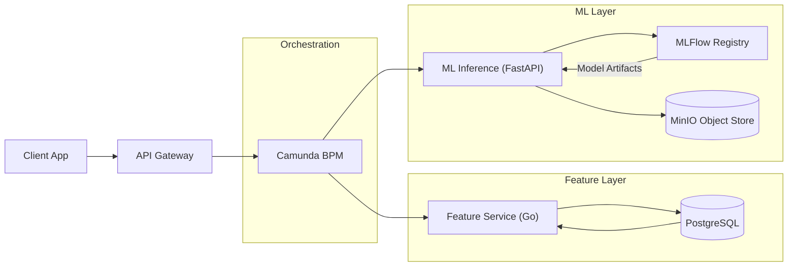

# Feature API — AntiFraud ML Scoring Platform  
**Camunda BPM → ETL → Feature Store → Go Service → Feature List → FastAPI → MLFlow Registry -> MinIO**.

Проект реализован в формате production-архитектуры, заточен под масштабирование и замену ML-моделей без даунтайма.

---

## Key Features

- **Feature Engineering**: вычисление поведенческих, временных и агрегированных признаков
- **Feature API Service (Go)**: быстрый low-latency сервис для отдачи фич из PostgreSQL. (REDIS )
- **ML Service (FastAPI)**: скоринг CatBoost модели, прокси через MLFlow Registry.
- **ML Model Hot-Swap**: автоматическая смена модели без перезапуска сервиса.
- **MinIO Object Store**: хранение версионированных конфигураций и fallback-конфигов.
- **Camunda BPM**: оркестрация бизнес-процесса.
- **Monitoring + Logging**: метрики, логи вызовов моделей, latency.

---

## Архитектура



---

## Prject Structure

```
feature_api/
│
├── camunda/                    # BPMN diagrams + configs
│
├── docker/                     # Dockerfiles
│
├── etl/                        # Feature engineering pipelines
│   ├── convert_raw_to_csv.py
│   └── samples/                # Ignored in git
│
├── feature-service/            # Go service: feature fetching
│   ├── main.go
│   ├── internal/http/
│   └── internal/repository/
│
├── ml/                         # Ml training
│   ├── data/
│   ├── processed/
│   └── src/
│
├── ml-serve/                   # FastAPI ML Service
│   ├── api/v1/
│   ├── configs/                # File loaded to MINIO via load_config_minio.py (Временно здесь)
│   ├── core/
│   ├── models/
│   ├── services/
│   ├── tests/
│   ├── main.py
│   └── requirements.txt
│
├── mlflow/                     # Local MLFlow setup
│   ├── pg_data/
│   └── python_etl_files
│
├── postgres/                   # PG as mini DWH layer
│   ├── data/
│   ├── dump/
│   └── init/
│
├── docker-compose.yaml
└── README.md
```

---

## Tech Stack

### ML / Data

* CatBoost
* MLFlow Registry
* SHAP / Eval metrics
* Pandas / NumPy
* PostgreSQL
* MinIO (S3 storage)

### Backend

* Go (feature service)
* FastAPI (ML inference)
* Uvicorn
* Pydantic models

### DevOps

* Docker / docker-compose
* GitLab CI/CD

### Orchestration

* Camunda BPMN workflows

---

## How Model Scoring Works

1. Camunda вызывает Feature API → получает агрегированные признаки.
2. Camunda передаёт признаки в ML-Serve.
3. FastAPI → запрашивает модель (на основе конфига в minio) из MLFlow по `model_name/version`.
4. Модель выполняет CatBoost-скоринг.
5. Результат возвращается в Camunda (approve/decline).
---

## ML Model Hot-Swap (Zero Downtime)

ML Serve сервис не хранит модель локально → он перераспрашивает MLFlow по:

```
models:/{run_id}/model
```

Чтобы заменить модель:

```
mlflow.register_model("runs:/<new_run_id>/model", "fraud_detector_s3")
mlflow.transition_model_version_stage -m "fraud_detector_s3" --version <num> --stage Production
```

Сервис автоматически подхватит новую модель при следующем запросе.

---

## Механизм конфигураций в MinIO

В MinIO хранятся:

* конфиги инференса
* fallback версии модели
* параметры threshold
* маппинги фичей
* список моделей для расчета

Пример структуры:

```
configs/
  antifraud_txn_v1.json
```

Конфиги версионируются через включённое MinIO versioning.

---

## Running Locally

### 1. Start infrastructure

```bash
docker-compose up -d
```

Поднимутся:

* PostgreSQL
* MLFlow + Postgres backend
* MinIO
* Feature Service (Go)
* ML-Serve (FastAPI)
* Camunda

## API Examples

### 1. Feature API

`POST http://127.0.0.1:9000/features`

Body:

```json
{
  "cst_dim_id": 2096229005,
  "transdate": "2025-03-04",
  "transdatetime": "2025-03-04 17:41:57.000",
  "amount": 4000.0,
  "docno": "8442",
  "direction": 1,
  "target": "b3a3d4a6006293195d998957d4f01e42"
}

```

Response:

```json
{
    "features": {
        "amount": 4000,
        "amount_bin": "ALL",
        "amount_clipped": 4000,
        //...
        "zscore_login_abs": 0.0267908985024482
    }
}
```

### 2. ML-Serve

`POST http://127.0.0.1:81/api/v1/score`

```json
{
    "features": {
        "amount": 4000,
        "amount_bin": "ALL",
        "amount_clipped": 4000,
        //...
        "zscore_login_abs": 0.0267908985024482
    }
}
```

Response:

```json
{
    "config_id": "antifraud_txn_v1",
    "models_count": 1,
    "results": {
        "fraud_detector_s3": {
            "role": "decision",
            "prediction": [
                0,32
            ]
        }
    }
}
```

## Future Improvements

* Streaming-фичи (Kafka + Flink/Spark Structured Streaming)
* Real-time feature store
* Ensemble моделей (CatBoost + LightGBM + anomaly detectors)
* Automated retraining pipeline
* Drift detection (data & concept drift)
* Full audit pipeline (граф связей, lineage, аудит)